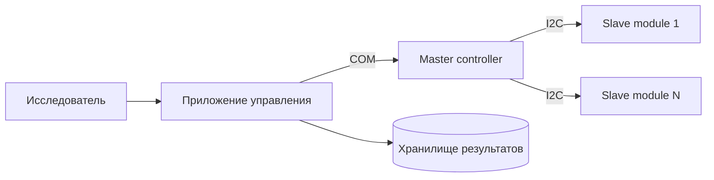
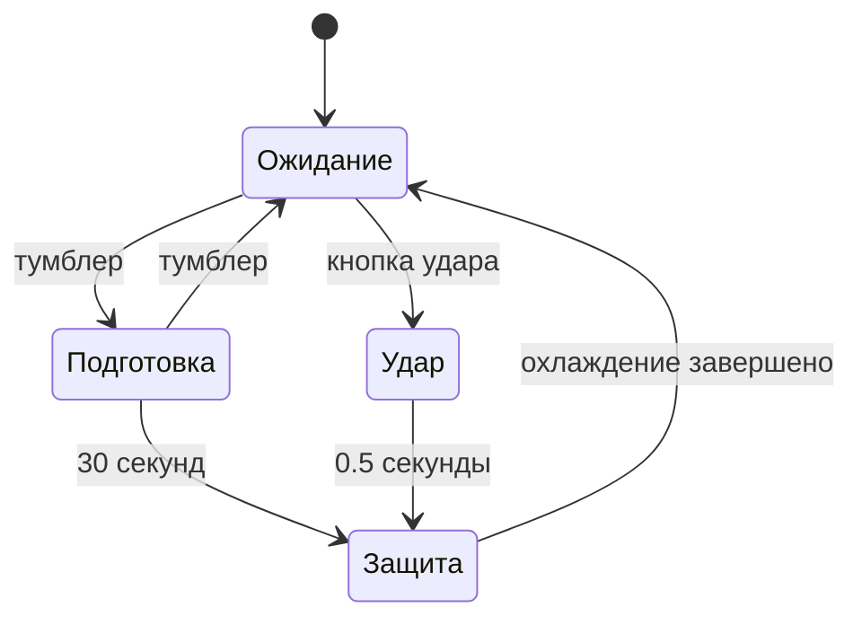

# R&D systems analysis case

Кейс показывает, как инженерный R&D-опыт переводится в работу системного аналитика. Описаны только безопасные для публикации сведения: без схем электроники, исходного кода, экспериментальных протоколов и персональных данных.

## Контекст

В лабораторных системах ошибка на границе между устройством, прошивкой, приложением и хранилищем данных может привести к потере измерения или некорректной интерпретации эксперимента. Поэтому до реализации важны явные сценарии, контракт данных и правила обработки отказов.

## Система фенотипирования

Стенд исследует когнитивные способности мелких лабораторных животных. Компьютерная программа задаёт протокол, ведущее устройство передаёт команды по I2C ведомым модулям, а результаты сохраняются для дальнейшего анализа.

### Аналитические артефакты

- сценарий подготовки, запуска и завершения эксперимента;
- модель интеграции «приложение → master → I2C-модули → данные»;
- правила адресации ведомых устройств и обработки недоступного модуля;
- критерии приёмки передачи команды, регистрации события и сохранения результата;
- тестовые сценарии ошибок: некорректные входные данные, обрыв связи, переполнение истории измерений.

## Устройство для моделирования ЧМТ

В проекте опытного образца управление строится вокруг двух режимов: подготовка и удар. Контроллер управляет релейной частью, а устройство ограничивает время работы для защиты от перегрева. На уровне анализа это означает явные состояния, условия переходов и безопасное поведение при тайм-ауте.

## Что показывает кейс

| Навык системного аналитика | Практическое проявление |
|---|---|
| Сбор требований | Перевод исследовательской задачи в сценарии устройства и ПО |
| Интеграции | Описание обмена между контроллером, приложением и хранилищем |
| Моделирование | Процессы эксперимента, состояния устройства, точки отказа |
| Приёмка | Проверяемые условия работы, тайм-ауты, ошибки данных и связи |

## Ограничения публикации

Кейс не содержит закрытые материалы, детальные принципиальные схемы, исходный код прошивок, результаты экспериментов или данные лабораторных животных. Он демонстрирует аналитический подход и инженерный контекст.
